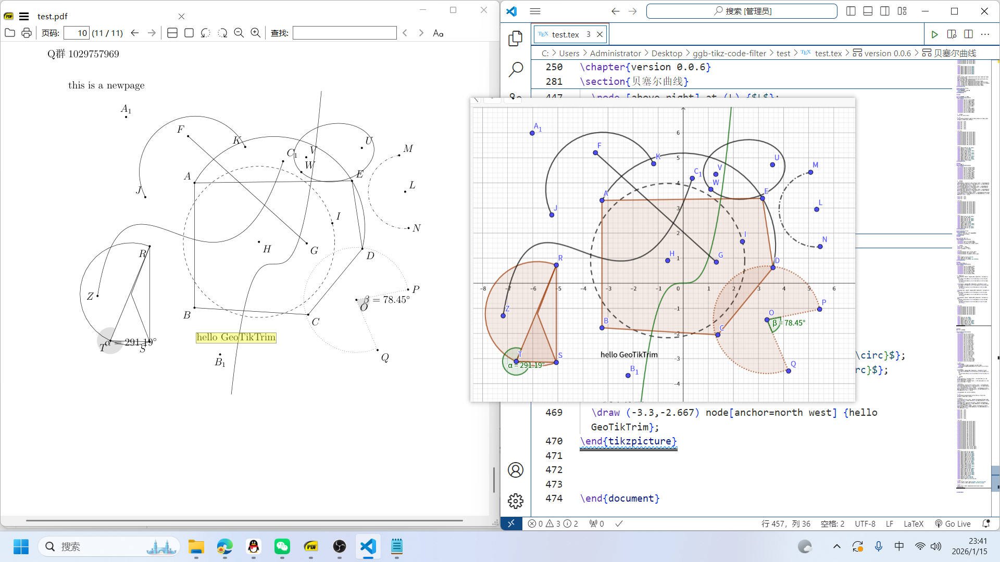

# GeoTikTrim — GeoGebra TikZ Code Filter

Live at: https://geotiktrim.site/

## Recommended: Browser Extension

One-click export and filter GeoGebra's verbose TikZ code directly in GeoGebra Classic, copied to clipboard instantly.

### Installation

1. Open the extensions page:
   - Edge: `edge://extensions/`
   - Chrome: `chrome://extensions/`
2. Enable "Developer mode"
3. Click "Load unpacked"
4. Select the `extension/` folder from this repository

### Usage

1. Open [GeoGebra Classic](https://www.geogebra.org/classic)
2. A floating panel appears on the right side of the page
3. Check your filter options, then click "Copy TikZ"
4. Paste into your `.tex` file

See [`extension/README.md`](extension/README.md) for details.

---

## Alternative: Web App

Open `GGB-Tikz-Code-Filter.html` directly in your browser or visit https://geotiktrim.site/, then manually paste GeoGebra-exported TikZ code to filter it.

---

## Features

- **Points**: coordinate definitions, markers, smart label positioning
- **Lines**: segments (deduplicated), line style conversion (solid, dashed, dotted, dash-dot)
- **Curves**: circles, ellipses (with rotation), arcs, sectors, Bezier curves
- **Functions**: function plots, quadratic functions, parametric equations
- **Markers**: angle marks and labels, text labels

---

## Screenshot



---

## Project Structure

```
ggb-tikz-code-filter/
├── GGB-Tikz-Code-Filter.html   # Web app (dev version)
├── Netlify-index/
│   └── index.html              # Web app (release version, identical content)
├── extension/                  # Browser extension
│   ├── manifest.json           # Chrome extension manifest
│   ├── content.js              # Script injection + communication bridge
│   ├── inject.js               # Access ggbApplet API
│   ├── filter.js               # Core TikZ filtering logic
│   ├── ui.js                   # Floating panel UI
│   ├── toast.js                # Toast notifications
│   ├── style.css               # Glassmorphism styling
│   └── icons/                  # Extension icons
├── test/                       # Test LaTeX documents
├── AI-Prompt.md                # AI maintenance guide
├── README.md
├── README.zh-CN.md
└── LICENSE
```

---

## Technical Details

- 100% client-side, no backend required
- Browser extension: Manifest V3, vanilla JavaScript
- Web app: Plain HTML + CSS + JavaScript

---

## Contributing

Issues and Pull Requests are welcome!

## License

GNU General Public License v2.0 — see the `LICENSE` file for details.
